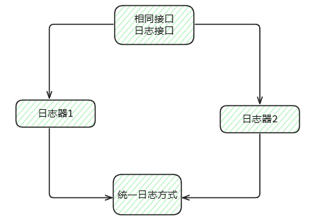

# Go 实现的 23 种设计模式

 Go 实现的 23 种设计模式拆分为 3 类：**创建型**、**结构型** 和 **行为型**

## 创建型设计模式（Creational Patterns）

在 Go 语言中，创建型模式（Creational Patterns）是一类用于处理对象创建的设计模式。它们的主要目标是提供一种灵活的方式来创建对象，同时隐藏对象创建的具体细节，从而降低代码的耦合度，并提高代码的可复用性和可维护性。

| 模式名称                              | 场景说明 / 用途                                  | Go 实现说明                            |
| ------------------------------------- | ------------------------------------------------ | -------------------------------------- |
| Singleton（单例，懒汉模式和饿汉模式） | **全局唯一**实例，如配置中心、数据库连接池等     | 使用 `sync.Once` 实现线程安全单例      |
| Simple Factory（简单工厂）            | 一个工厂类负责创建所有产品，通过条件判断创建对象 | 使用工厂函数 + 接口，根据参数返回实例  |
| Factory Method（工厂方法）            | 子类决定创建哪种对象，如根据类型返回不同的处理器 | 用接口定义返回类型，用函数封装工厂方法 |
| Abstract Factory（抽象工厂）          | 创建一组相关对象，如 UI 控件的不同风格           | 返回一组接口实例，封装创建多个产品族   |
| Builder（建造者）                     | 构建复杂结构体，如数据库连接参数链式配置         | **使用结构体和函数链式调用实现**       |
| Prototype（原型）                     | **克隆已有对象**，如缓存数据复制                 | 借助 `encoding/gob` 或 `json` 实现复制 |

**简单工厂**

**工厂方法**

**工厂模式让你“按需造物”，而不是“手动造物”。你告诉工厂你要什么，它给你造好，细节不用你操心。**

## 结构型设计模式（Structural Patterns）

结构型设计模式（Structural Design Patterns）主要关注如何将类和对象组合成更大的结构，旨在简化系统中的类和对象之间的关系，确保它们可以高效地协作。

| 模式名称            | 场景说明 / 用途                            | Go 实现说明            |
| ------------------- | ------------------------------------------ | ---------------------- |
| Adapter（适配器）   | **转换接口**，如封装日志库输出为统一格式   | 封装适配结构或函数     |
| Bridge（桥接）      | 抽象与实现分离，如日志系统支持多种输出方式 | 使用接口进行抽象与组合 |
| Composite（组合）   | 树形结构，如文件系统、菜单栏               | 接口 + 递归结构体      |
| Decorator（装饰器） | 动态增强功能，如添加缓存、日志             | 函数组合或结构体组合   |
| Facade（外观）      | 简化复杂系统接口，如一站式 API             | 封装多个子模块         |
| Flyweight（享元）   | 对象复用，如连接池、字体缓存               | map 缓存复用结构体     |
| Proxy（代理）       | 控制访问，如 RPC 代理、安全检查            | 用结构体包装真实对象   |

**Adapter（适配器）**

适配器模式（Adapter Pattern）常用于**封装已有库或模块**，让它们适配我们期望的接口格式。

## 行为型设计模式（Behavioral Patterns）

**行为型设计模式**（Behavioral Design Patterns）关注的是对象或类之间的通信方式和职责分配，特别是如何通过定义对象之间的交互来优化系统中的流程、算法或逻辑。它们主要用于描述对象如何协作、交互以及如何将任务和责任在对象之间分配。

> **行为型设计模式和结构型设计模式的区别**

- **行为型模式**：解决**如何与其他对象交互**、**行为协调**的问题。

- **结构型模式**：解决**如何组织和组合对象**、**优化结构**的问题。

| 模式名称                          | 场景说明 / 用途                         | Go 实现说明                     |
| --------------------------------- | --------------------------------------- | ------------------------------- |
| Chain of Responsibility（责任链） | 多个处理器依次处理请求，如中间件链      | 函数组合，顺序调用              |
| Command（命令）                   | 封装请求为对象，如任务队列、撤销命令    | 结构体 + 执行方法               |
| Interpreter（解释器）             | 计算表达式、DSL 解析器                  | 表达式树 + 递归求值             |
| Iterator（迭代器）                | 顺序访问集合，如自定义容器遍历          | 封装结构体或使用 `channel` 实现 |
| Mediator（中介者）                | 控制对象间通信，如聊天室、调度器        | 使用事件总线或中央调度器        |
| Memento（备忘录）                 | 保存/恢复对象状态，如编辑器的撤销功能   | 保存快照结构体                  |
| Observer（观察者）                | 发布订阅，如配置热更新、事件广播        | 函数列表或 `channel` 广播       |
| State（状态）                     | 对象状态转换，如订单状态机              | 接口实现不同状态行为            |
| Strategy（策略）                  | 切换算法行为，如压缩、排序策略          | 用接口或函数传参                |
| Template Method（模板方法）       | 定义流程骨架，子类实现具体步骤          | 接口+骨架函数                   |
| Visitor（访问者）                 | 对不同类型元素执行操作，如 AST 节点遍历 | 接口 + 多态调用                 |